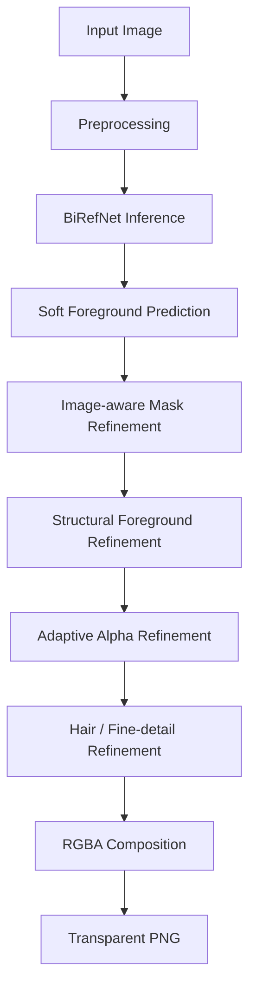

# AI Background Removal System

A BiRefNet-based background-removal system with custom structural foreground analysis, adaptive alpha refinement, and fine-detail processing.

The project extends pretrained foreground segmentation with a modular post-processing pipeline designed to improve mask quality, preserve soft boundaries, refine uncertain edges, and better handle fine structures such as hair and fur.

## Live Demo

Try the deployed ZeroGPU version on Hugging Face Spaces:

[**Open Live Demo →**](https://huggingface.co/spaces/RazaAli89/bg_remover)

## Demo Results

| Input | Background Removed |
|---|---|
|  |  |
|  |  |
|  |  |

## Features

- Pretrained **BiRefNet** foreground segmentation
- Soft-mask preservation instead of immediately converting predictions into a hard binary mask
- Image-aware mask refinement
- Structural foreground analysis using:
  - connected components
  - contours
  - morphology
  - skeletonization
  - distance transforms
  - region geometry
- Edge-aware adaptive alpha refinement
- Hair, fur, and fine-detail refinement
- Reusable model loading through a service layer
- FastAPI inference endpoint returning transparent PNG output
- Gradio user interface
- Hugging Face Spaces deployment with ZeroGPU
- Stage-level timing and throughput logging
- Automatic CPU/CUDA device selection

## Pipeline



The core background-removal pipeline is shared by both the FastAPI and Gradio serving layers.

## Serving Options

### FastAPI

Start the API server:

```bash
uvicorn app.api.app:app --host 0.0.0.0 --port 8000
```

Interactive API documentation:

```text
http://127.0.0.1:8000/docs
```

Health check:

```text
GET /health
```

Background-removal endpoint:

```text
POST /api/v1/remove-background
Content-Type: multipart/form-data
field: file
```

### Gradio / Hugging Face Spaces

Start the Gradio interface locally:

```bash
python space_app.py
```

Then open:

```text
http://127.0.0.1:7860
```

`space_app.py` uses the same core `BackgroundRemovalService` and decorates inference with `@spaces.GPU` for ZeroGPU-compatible deployment on Hugging Face Spaces.

## Project Structure

```text
.
├── app/
│   ├── api/                 # FastAPI application and routes
│   ├── config/              # Runtime settings and constants
│   ├── core/                # Logging and domain exceptions
│   ├── inference/           # BiRefNet loading and prediction
│   ├── postprocessing/      # Custom refinement pipeline
│   ├── preprocessing/       # Input preprocessing and transforms
│   ├── services/            # End-to-end background-removal service
│   └── utils/               # Benchmarking, timing, file/device helpers
│
├── assets/                  # Demo input/output examples
│
├── scripts/
│   └── batch_process.py     # Batch-processing utility
│
├── space_app.py             # Gradio / ZeroGPU entry point
├── .env.example             # Example configuration
├── .gitignore
├── requirements.txt
└── README.md
```

## Installation

Clone the repository:

```bash
git clone https://github.com/RazaAli9/ai-background-removal-system.git
cd ai-background-removal-system
```

Create a virtual environment:

```bash
python -m venv .venv
```

### Windows

```powershell
.venv\Scripts\Activate.ps1
```

If PowerShell blocks script execution for the current session:

```powershell
Set-ExecutionPolicy -Scope Process -ExecutionPolicy RemoteSigned
.venv\Scripts\Activate.ps1
```

### Linux / macOS

```bash
source .venv/bin/activate
```

Install the dependencies:

```bash
pip install -r requirements.txt
```

## Configuration

The default model is:

```text
ZhengPeng7/BiRefNet
```

Device selection defaults to:

```text
auto
```

This uses CUDA when available and otherwise falls back to CPU.

Optional local configuration can be created from `.env.example`.

### Linux / macOS

```bash
cp .env.example .env
```

### Windows

```powershell
Copy-Item .env.example .env
```

Normalization tuple environment variables use JSON-array syntax.

Example:

```text
NORMALIZE_MEAN=[0.485, 0.456, 0.406]
NORMALIZE_STD=[0.229, 0.224, 0.225]
```

## Model Attribution

This project uses the pretrained **BiRefNet** model by ZhengPeng.

Upstream sources:

- [BiRefNet on Hugging Face](https://huggingface.co/ZhengPeng7/BiRefNet)
- [BiRefNet on GitHub](https://github.com/ZhengPeng7/BiRefNet)

BiRefNet is published under the MIT License.

Model weights are **not included** in this repository and are loaded from the upstream model source at runtime.

## Results and Evaluation

The system includes stage-level runtime benchmarking for:

- preprocessing
- model inference
- post-processing
- output saving
- total execution time
- images per second

Formal segmentation-quality metrics such as IoU, Dice, MAE, or boundary accuracy have not yet been established on a fixed evaluation dataset.

For that reason, this repository intentionally makes no unsupported accuracy claim.

Local CPU development timings should also not be interpreted as representative of Hugging Face ZeroGPU production performance.

## Deployment

The project has two serving paths built around the same core inference and refinement pipeline:

```text
Core Background-Removal Pipeline
            │
            ├── FastAPI REST API
            │
            └── Gradio Interface
                     │
                     └── Hugging Face Spaces / ZeroGPU
```

Public demo:

[https://huggingface.co/spaces/RazaAli89/bg_remover](https://huggingface.co/spaces/RazaAli89/bg_remover)

## License

The original application and refinement code in this repository is not currently distributed under an open-source license.

Third-party models, libraries, and dependencies remain subject to their respective licenses.

BiRefNet is used as a pretrained model and is attributed in the **Model Attribution** section above.
