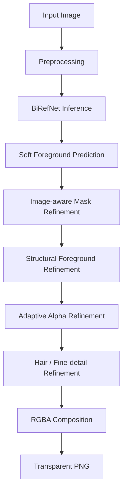

# AI Background Removal System

A BiRefNet-based background-removal pipeline with custom mask refinement, structural foreground analysis, adaptive alpha refinement, and hair/fine-detail processing. The same core inference pipeline can be served through FastAPI or deployed as a Gradio application on Hugging Face Spaces / ZeroGPU.

> **Portfolio note:** This repository is intended to demonstrate the end-to-end engineering pipeline: model loading, preprocessing, inference, post-processing, benchmarking, API serving, and GPU-backed demo deployment.

## Highlights

- Pretrained **BiRefNet** foreground segmentation
- Soft-mask preservation instead of immediately collapsing predictions to a binary mask
- Image-aware mask refinement
- Structural foreground analysis with connected components, contours, morphology, skeletonization, distance transforms, and region geometry
- Edge-aware adaptive alpha refinement
- Hair / fur / fine-detail refinement
- Reusable model loading through a service layer
- FastAPI upload endpoint returning transparent PNG output
- Gradio + Hugging Face Spaces / ZeroGPU deployment entry point
- Stage-level timing and throughput logging

## Pipeline



## Serving Options

### FastAPI

```bash
uvicorn app.api.app:app --host 0.0.0.0 --port 8000
```

Health check:

```text
GET /health
```

Background removal:

```text
POST /api/v1/remove-background
Content-Type: multipart/form-data
field: file
```

### Gradio / Hugging Face Spaces

```bash
python space_app.py
```

`space_app.py` uses the same core `BackgroundRemovalService` and decorates inference with `@spaces.GPU` for ZeroGPU-compatible deployment.

## Project Structure

```text
.
├── app/
│   ├── api/                 # FastAPI application and routes
│   ├── config/              # Runtime settings
│   ├── core/                # Logging and domain exceptions
│   ├── inference/           # BiRefNet loading + prediction
│   ├── postprocessing/      # Custom refinement pipeline
│   ├── preprocessing/       # Input transforms
│   ├── services/            # End-to-end background-removal service
│   └── utils/               # Benchmarking, timing, file/device helpers
├── scripts/
│   └── batch_process.py
├── space_app.py             # Gradio / ZeroGPU entry point
├── .env.example
├── .gitignore
└── requirements.txt
```

## Installation

Create and activate a virtual environment, then install the dependencies:

```bash
pip install -r requirements.txt
```

Optional local configuration:

```bash
cp .env.example .env
```

On Windows, copy `.env.example` to `.env` manually.

## Configuration

The default model is `ZhengPeng7/BiRefNet`. Device selection defaults to `auto`, which uses CUDA when available and otherwise CPU.

The normalization tuple environment variables use JSON-array syntax, for example:

```text
NORMALIZE_MEAN=[0.485, 0.456, 0.406]
```

## Model Attribution

This project uses the pretrained **BiRefNet** model by ZhengPeng. The upstream model is available at:

- https://huggingface.co/ZhengPeng7/BiRefNet
- https://github.com/ZhengPeng7/BiRefNet

BiRefNet is published under the MIT License. Model weights are **not included** in this repository and are loaded from the upstream model source at runtime.

## Results and Evaluation

The project includes stage-level runtime benchmarking for preprocessing, inference, post-processing, saving, total execution time, and images/second.

Formal segmentation metrics such as IoU, Dice, MAE, or boundary accuracy have not yet been established on a fixed evaluation dataset, so this repository intentionally makes no unsupported accuracy claim. CPU development timings should also not be interpreted as ZeroGPU production performance.

## Security / Repository Hygiene

The public repository should not contain:

- `.env` or credentials
- Hugging Face tokens
- downloaded model checkpoints
- runtime logs
- generated output images
- virtual environments or Python bytecode
- private/client test images

The included `.gitignore` excludes these common artifacts.

## License / Publication Note

No open-source license for the repository's original application/refinement code is included in this candidate package. Before publishing, confirm that you own or have permission to publish all source code, particularly if any part was produced during an internship or for an employer. Third-party components remain subject to their own licenses.
